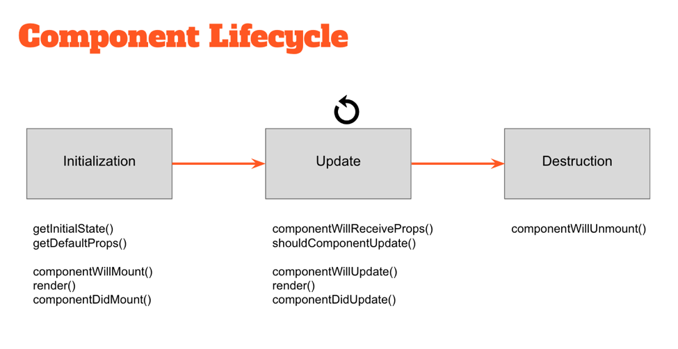

## Essential React.js Interview Questions

(taken from [codementor](https://www.codementor.io/reactjs/tutorial/5-essential-reactjs-interview-questions))

### 1. What is React?

  *React is an open-source JavaScript library created by Facebook for building complex, interactive UIs in web and mobile applications.*


Key points:
+ React builds UI components
+ Predominantly the "V" (View) in MVC
  - Therefore has no opinions on the other pieces of your technology stack and can be seamlessly integrated into any application

#### How is React different?

+ Under what circumstances would you choose React over (AngularJS, etc)?
  - easy to learn, natural to use
  - easier to swap for something better in the future
  - React uses Flux, where data flow is unidirectional
  - React has a pure JS approach.
    When used with the JSX library, allows you to define the HTML view in the js file itself
  - Reach works with the Virtual DOM and not the DOM directly

  

  Quick input about AngularJS
  - Two-way binding:
    Any data-related changes affecting the model are immediately propagated to the matching view(s), and that any changes made in the view(s) (say, by the user) are immediately reflected in the underlying model. When the app data changes, so does the UI, and conversely.
  - Dirty checking is carried out after *any* operation is performed within Angular's score ($digest cycle) which leads to slower performance as the amount of binding increases
  - Steep learning curve
    Modules, controllers, directives, scopes, templating, linking functions, filters dependency injection

  Great comparision by Pete Hunt (Facebook/Instagram) on [AngularJS vs React](https://www.quora.com/profile/Pete-Hunt/Posts/Facebooks-React-vs-AngularJS-A-Closer-Look)


+ Other potential questions to consider
  - If React only focuses on a small part of building UI components, can you explain some pitfalls one might encounter when developing a large application?
  - If you were rewriting an AngularJS application in React, how much code could you expect to re-use?


### 2. What happens during the lifecycle of a React component?

#### High-level component lifecycle
At the highest level, React components have lifecycle events that fall into three general categories:

1. Initialization
2. State/Property Updates
3. Destruction

Every React component defines these events as a mechanism for managing its properties, state, and rendered output. Some of these events only happen once, others happen more frequently; understanding these three general categories should help you clearly visualize when certain logic needs to be applied.

For example, a component may need to add event listeners to the DOM when it first mounts. However, it should probably remove those event listeners when the component unmounts from the DOM so that irrelevant processing does not occur.
```js
class MyComponent extends React.Component {
    // when the component is added to the DOM...
    componentDidMount() {
        window.addEventListener(‘resize’, this.onResizeHandler);
    }

    // when the component is removed from the DOM...
    componentWillUnmount() {
        window.removeEventListener(‘resize’, this.onResizeHandler);
    }

    onResizeHandler() {
        console.log(‘The window has been resized!’);
    }
}
```

#### Low-level component lifecycle


Within these three general buckets exist a number of specific lifecycle hooks — essentially abstract methods — that can be utilized by any React component to more accurately manage updates. Understanding how and when these hooks fire is key to building stable components and will enable you to control the rendering process (improving performance).

Take a look at the diagram above. The events under “Initialization” only happen when a component is first initialized or added to the DOM. Similarly, the events under “Destruction” only happen once (when the component is removed from the DOM). However, the events under “Update” happen every time the properties or state of the component change.

For example, components will automatically re-render themselves any time their properties or state change. However, in some cases a component might not need to update — so preventing the component from re-rendering might improve the performance of our application.

```js
class MyComponent extends React.Component {

    // only re-render if the ID has changed!
    shouldComponentUpdate(nextProps, nextState) {
        return nextProps.id === this.props.id;
    }
}
```
**For more specific details**, go through [React docs on component lifecycle](https://facebook.github.io/react/docs/react-component.html)
<!-- Links -->
